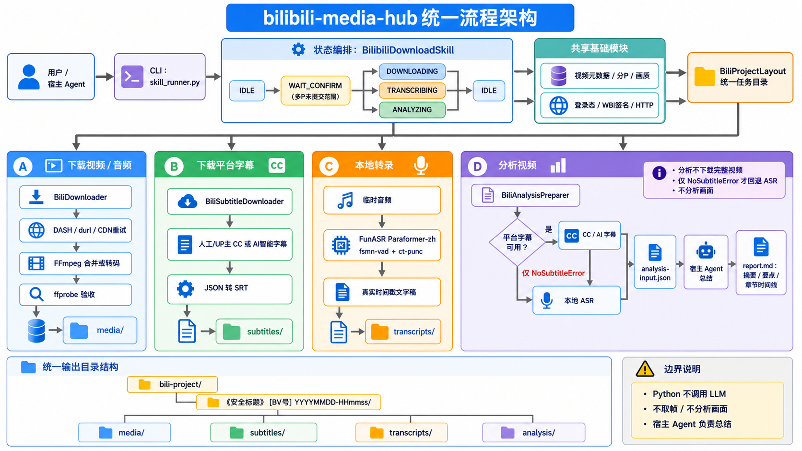

# bilibili-media-hub

> 给 B 站视频用的本地处理 Skill：给它一个 BV 号，就能下载视频/音频、拿到平台字幕、把语音转成带时间戳的文字稿，还能让宿主 Agent 基于真实字幕时间生成摘要、核心要点和章节时间线。

它不是网页下载站，也不会把视频上传到第三方服务。主要处理过程在本地完成，适合接到支持 `SKILL.md` 的 Agent，也可以直接当命令行工具使用。



## 能做什么？

| 你想做的事 | bilibili-media-hub 会做什么 |
| --- | --- |
| 下载 B 站视频 | 下载单 P、指定分 P 或全部分 P，可指定画质 |
| 只要音频 | 抽取音频并保存到本地 |
| 下载字幕 | 获取 B 站已有的人工 / UP 主 CC / AI 智能字幕，并保存为 SRT |
| 视频转文字 | 使用本地 FunASR 把音频转成带时间戳的文字稿 |
| 总结长视频 | 优先读取平台字幕，没有字幕时再回退本地转录，由宿主 Agent 生成摘要、核心要点和章节时间线 |

另外还做了一些“看不见但很实用”的事情：下载后用 `ffprobe` 检查文件是否真的有效、网络失败时支持重试和备用 CDN、自动处理 Windows 文件名非法字符，并对视频标题等外部元数据做安全转义。

## 最简单的用法：直接和 Agent 说人话

如果你的 Agent 能读取这个项目的 `SKILL.md`，通常不需要记命令，直接说：

```text
下载这个 B 站视频 BV1xx411c7mD
把 BV1xx411c7mD 的音频下载下来
下载 BV1xx411c7mD 的字幕
帮我转录 BV1xx411c7mD
总结 BV1xx411c7mD，并给我章节时间线
下载 BV1xx411c7mD 的第 1、3 P
```

Skill 会根据你的需求选择下载、字幕、转录或分析流程。

## 快速开始

### 1. 下载项目

```bash
git clone https://github.com/9Kun/bilibili-media-hub.git
cd bilibili-media-hub
```

### 2. 安装 Python 依赖

如果只需要**下载视频 / 音频 / 字幕**：

```bash
pip install httpx
```

如果还需要**本地转录**或希望分析流程在没有平台字幕时自动回退 FunASR：

```bash
pip install funasr
```

也可以一次安装仓库当前列出的依赖：

```bash
pip install -r requirements.txt
```

> 第一次使用 FunASR 转录时，会自动下载 Paraformer-zh 模型到 `~/.cache/funasr`，大约 1.5 GB；以后会直接使用本地缓存。

### 3. 准备 FFmpeg

下载媒体需要可用的：

- `ffmpeg`
- `ffprobe`

如果它们已经在系统 `PATH` 中，不需要额外配置。

如果没有，也可以在命令中显式指定：

```bash
python scripts/skill_runner.py --bvid BV1xx411c7mD --ffmpeg-path /path/to/ffmpeg
```

Windows 也可以直接传 `ffmpeg.exe` 的路径；程序会优先寻找同目录下的 `ffprobe.exe`。

## 命令行示例

### 下载视频

```bash
python scripts/skill_runner.py --bvid BV1xx411c7mD
```

默认会选择当前账号实际可用的最高画质。

### 指定画质

例如请求 4K（B 站 qn=120）：

```bash
python scripts/skill_runner.py --bvid BV1xx411c7mD --quality 120
```

指定画质时是**严格请求**：如果该分 P 没有这个档位，会直接告诉你实际可用画质，而不是悄悄降低清晰度。

常用 qn：

| qn | 画质 |
| ---: | --- |
| 120 | 4K |
| 116 | 1080P 60 帧 |
| 112 | 1080P 高码率 |
| 80 | 1080P |
| 64 | 720P |
| 32 | 480P |

完整档位说明见 [`SKILL.md`](SKILL.md)。

### 下载指定分 P

```bash
python scripts/skill_runner.py --bvid BV1xx411c7mD --pages "1,3"
```

下载全部分 P：

```bash
python scripts/skill_runner.py --bvid BV1xx411c7mD --all-pages
```

### 下载音频

```bash
python scripts/skill_runner.py --bvid BV1xx411c7mD --media-type audio
```

### 下载平台字幕

```bash
python scripts/skill_runner.py --bvid BV1xx411c7mD --subtitle
```

指定字幕语言：

```bash
python scripts/skill_runner.py --bvid BV1xx411c7mD --subtitle --subtitle-lang "zh-CN"
```

字幕会保存为标准 `.srt` 文件。

### 本地转录

```bash
python scripts/skill_runner.py --bvid BV1xx411c7mD --transcribe
```

默认使用 CPU。已经配置 CUDA 时，可以：

```bash
python scripts/skill_runner.py --bvid BV1xx411c7mD --transcribe --device cuda
```

生成的文字稿带真实时间戳，例如：

```text
[00:00] 欢迎大家来体验。
[00:05] 这是一个测试视频。
[00:12] 主要演示转录功能。
```

### 准备视频分析材料

```bash
python scripts/skill_runner.py --bvid BV1xx411c7mD --analyze
```

这里有一个重要区别：

**Python 不会自己调用 LLM 生成总结。**

`--analyze` 做的是：

1. 先尝试获取 B 站已有的人工 / UP 主 CC / AI 智能字幕；
2. 如果平台确实没有可用字幕，再回退到本地 FunASR 转录；
3. 保留真实时间戳并生成 `analysis-input.json`；
4. 由当前宿主 Agent 阅读这些材料，生成最终的 `report.md`。

因此章节时间线来自真实字幕或转录时间，不靠模型猜时间点。

完整报告通常包含：

- AI 标题
- 一句话结论
- 内容摘要
- 详细总结
- 3～8 条核心要点
- 章节时间线
- 多 P 视频的分 P 分析

详细规范见 [`reference/analysis-report.md`](reference/analysis-report.md)。

## 字幕下载和转录有什么区别？

这是最容易混淆的地方：

**字幕下载**：直接拿 B 站已经存在的字幕，速度快，不需要 FunASR，但前提是视频本身有可用的平台字幕。

**本地转录**：先读取视频音频，再由 FunASR 在本地识别。即使视频没有字幕也能用，但准确率会受到口音、背景噪声和专有名词影响。

如果你只是想总结视频，项目会优先使用平台字幕；没有时才回退本地转录。

## 登录与更高画质

未登录时能拿到的画质和字幕会受到 B 站接口限制。想获取更高画质或部分 AI 字幕，可以通过环境变量提供自己的 B 站登录态：

### PowerShell

```powershell
$env:BILI_COOKIES="SESSDATA=xxx;bili_jct=xxx;DedeUserID=xxx"
```

### Linux / macOS

```bash
export BILI_COOKIES='SESSDATA=xxx;bili_jct=xxx;DedeUserID=xxx'
```

程序从环境变量读取，不需要把 cookies 写进项目文件。

> 不要把真实 cookies 提交到 Git 仓库，也不要分享给不可信的第三方。最终可用画质仍取决于视频本身、账号权限和 B 站接口实时返回结果。

## 文件会保存到哪里？

`--save-dir` 指的是工作目录。每次真正开始一个任务，会自动创建独立目录：

```text
<工作目录>/bili-project/《视频标题》 [BV号] 时间戳/
├─ media/          # 视频 / 音频
├─ subtitles/      # 平台字幕 SRT
├─ transcripts/    # FunASR 文字稿
└─ analysis/       # 分析输入与最终报告
```

例如：

```text
bili-project/
└─ 《示例视频》 [BV1xxxx] 20260905-120000/
   ├─ media/
   ├─ subtitles/
   ├─ transcripts/
   └─ analysis/
      ├─ analysis-input.json
      └─ report.md
```

不同任务不会混在一起；同一个任务里的多 P 或多个媒体版本会放在对应的同一任务目录中。

## 能力边界

这个项目适合做“基于 B 站视频音频、字幕和文字内容的本地处理”，但它不是万能的视频理解工具：

- 目前以 **BV 号**作为主要输入；
- 没有账号权限的会员专享内容，提供登录态也不会绕过权限；
- 视频没有音轨时无法做语音转录；
- `--subtitle` 只能下载 B 站已经存在的平台字幕，不会凭空生成“平台字幕”；
- 分析流程**不取视频帧、不做画面识别**，只基于标题、简介、字幕或 ASR 文字稿；
- 当前按单任务顺序执行，不建议同时启动多个下载 / 转录任务。

请只处理你有权访问、保存和使用的内容，并遵守相关版权规定及平台规则。

## 项目结构

```text
bilibili-media-hub/
├─ SKILL.md                         # 给宿主 Agent 的完整 Skill 说明
├─ scripts/
│  ├─ skill_runner.py               # CLI 入口
│  └─ bilibili_download_skill.py    # 任务状态与流程编排
├─ core/
│  ├─ bili_downloader.py            # 下载、WBI 签名、FFmpeg 合并与校验
│  ├─ bili_subtitle_downloader.py   # CC / AI 字幕 → SRT
│  ├─ bili_transcriber.py           # FunASR 本地转录
│  ├─ bili_analysis.py              # 分析材料准备
│  ├─ output_layout.py              # 输出目录与安全文件名
│  └─ text_safety.py                # 对外文本安全处理
├─ reference/
│  ├─ python-usage-order.md          # Agent 调用细节
│  └─ analysis-report.md             # 分析报告规范
├─ docs/
│  └─ bilibili-media-hub-architecture.png
└─ tests/                            # 下载 / 字幕 / 转录 / 分析等回归测试
```

## 运行测试

测试使用 Python 标准库 `unittest`：

```bash
python -m unittest discover -s tests -v
```

测试覆盖下载器解析、画质选择、字幕、转录、分析流程、输出目录，以及来自视频元数据的文本安全处理等关键行为。

## 常见问题

### 为什么只能下载到 720P 左右？

通常是登录态或账号权限问题。配置 `BILI_COOKIES` 后再试，并以接口实际返回的可用画质为准。

### 为什么字幕下载失败，但转录可以？

因为两者不是一回事。字幕下载依赖 B 站平台本身已经提供字幕；转录则直接识别音频。

### 为什么第一次转录特别慢？

第一次需要下载大约 1.5 GB 的 FunASR Paraformer-zh 模型。下载完成后会缓存到本地，后续不会重复下载。

### 总结里的章节时间可靠吗？

章节起点只能使用字幕或转录里已经存在的真实时间戳。Agent 可以判断“这里开始讲什么”，但不允许凭空编造时间。

## 更完整的说明

README 主要给第一次使用的人看。如果你要接入 Agent、开发新能力或了解完整参数和状态机，请继续阅读：

- [`SKILL.md`](SKILL.md) — 完整 Skill 使用规范
- [`reference/python-usage-order.md`](reference/python-usage-order.md) — Python / Agent 调用顺序
- [`reference/analysis-report.md`](reference/analysis-report.md) — 视频分析报告规范
